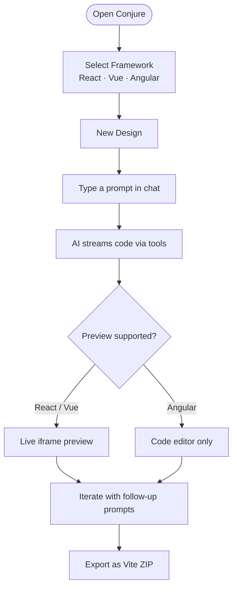
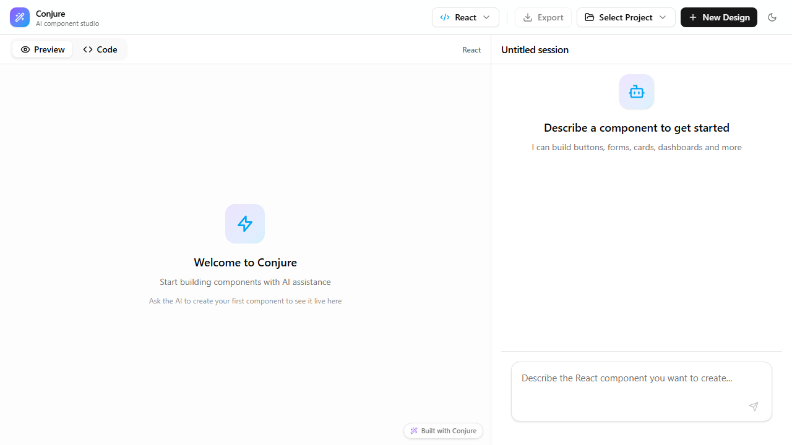
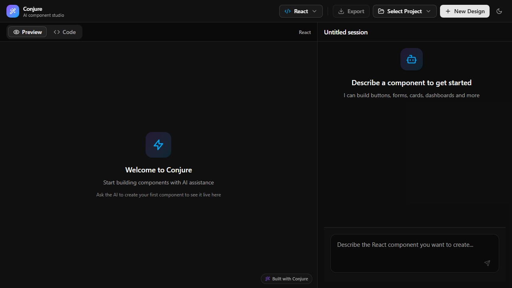
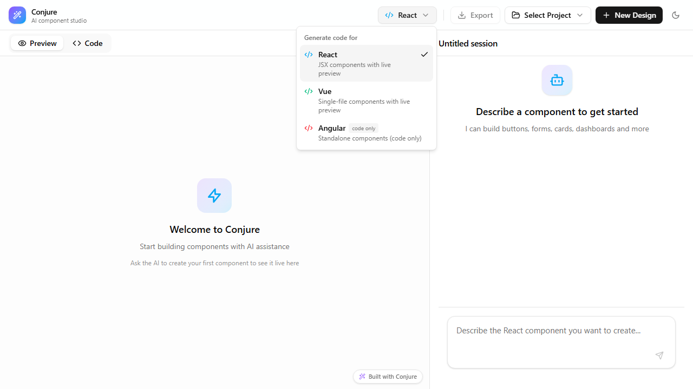
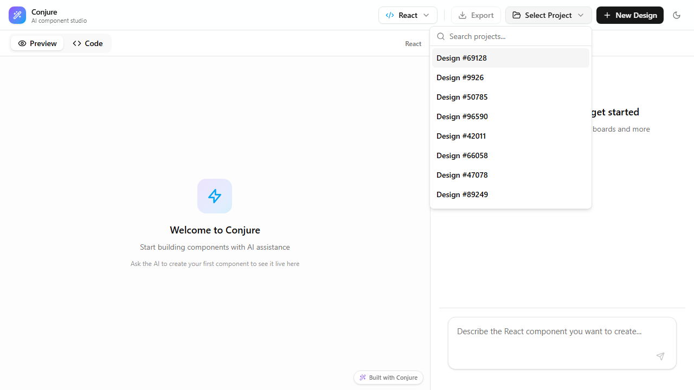
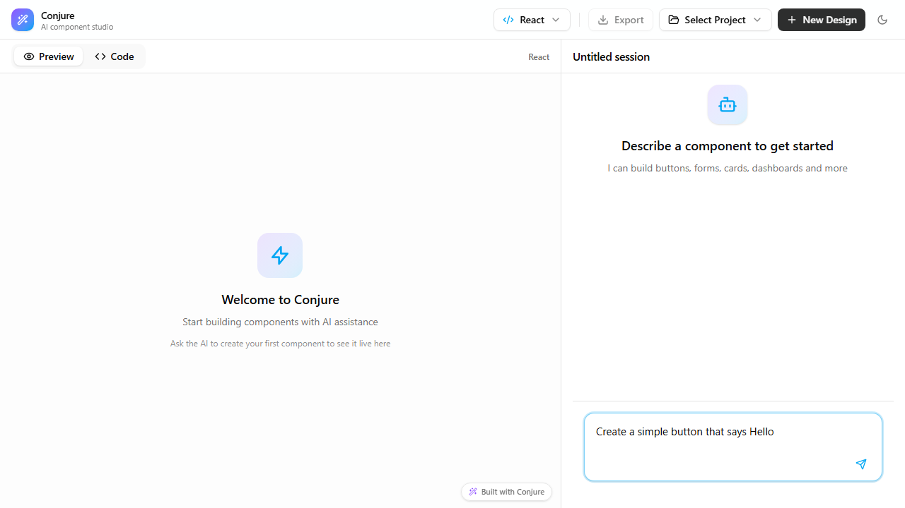
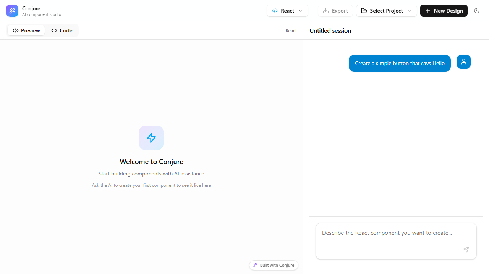
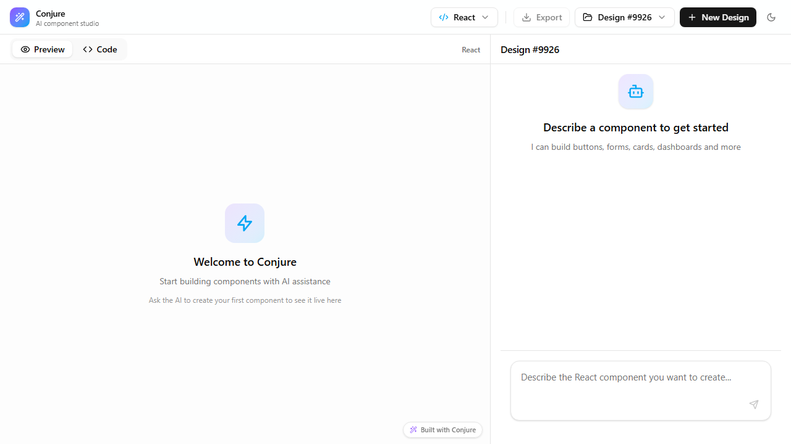
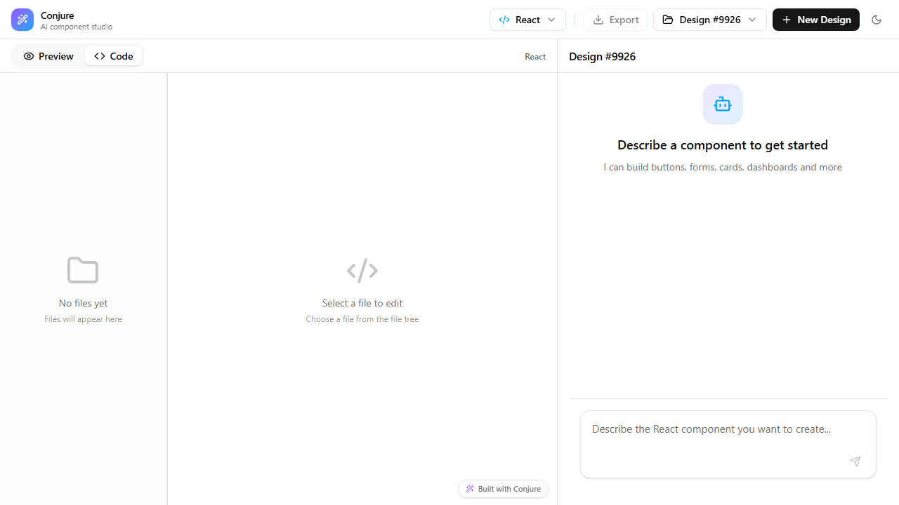
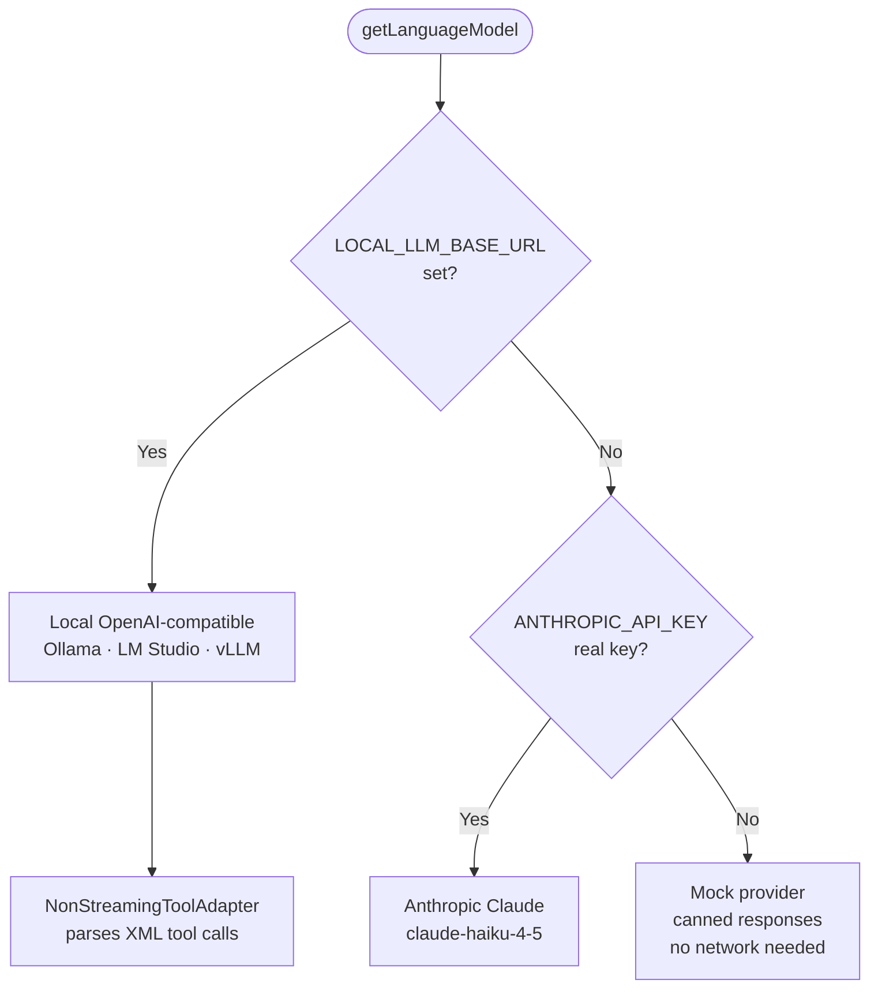

# Conjure — Visual Walkthrough

Screenshots captured automatically by the Playwright suite in `e2e/screenshots.spec.ts`.
To regenerate: `npm run screenshots` (dev server must be running or will be started automatically).

---

## How Conjure works



---

## Core data flow

```mermaid
flowchart LR
    U([User prompt]) --> Chat
    Chat -->|POST\nmessages + VFS + framework| Route[/api/chat]
    Route --> LLM[AI Model\nClaude · local LLM · mock]
    LLM -->|str_replace_editor| VFS[(Virtual\nFile System)]
    LLM -->|file_manager| VFS
    VFS -->|onToolCall mirror| Client[Client VFS]
    Client -->|refreshTrigger| Preview[iframe Preview]
    Route -->|onFinish| DB[(SQLite\nvia Prisma)]
```

---

## Screens

### 1. Empty workspace — light theme

The default view on first load. The left panel shows the live preview area; the right panel is the chat pane. The top bar has the framework selector, export button, project picker, and theme toggle.



---

### 2. Empty workspace — dark theme

The same layout with the dark theme active. The choice is stored in `localStorage` and applied before first paint with no flash.



---

### 3. Framework selector

Click the framework button in the top bar to switch between React (live preview), Vue (live preview), and Angular (code only). The selection changes the system prompt sent to the AI on the next turn.



---

### 4. Project selector

The project picker lists all saved designs. Type to filter, click to open, or use the trash icon to delete a project with confirmation.



---

### 5. New project

After clicking **New Design** a project is created in SQLite and the workspace is ready. The chat pane title defaults to "Untitled session" — click it to rename inline.


---

### 6. Prompt typed

Type a description in the chat textarea. Press **Enter** (or the send button) to submit. Shift+Enter adds a newline.



---

### 7. AI generating

While the model runs (up to 40 agentic steps), the textarea is disabled and the chat shows a streaming response. Tool calls write files directly into the virtual file system.



---

### 8. Live preview

Once generation finishes, the iframe renders the component. React files are compiled in-browser by Babel standalone and wired through an import map to React on a CDN.



---

### 9. Code editor

Switch to the **Code** tab to see the full file tree and a Monaco editor. Editing a file updates the virtual file system; switching back to Preview re-renders.



---

### 10. Dark theme with generated component

Dark mode works throughout the live preview and the editor, adapting to the Tailwind theme tokens used by the app shell.


---

## Provider fallback chain



Set providers in `.env` — copy `.env.example` to get started.
See [providers.md](providers.md) for full details.
